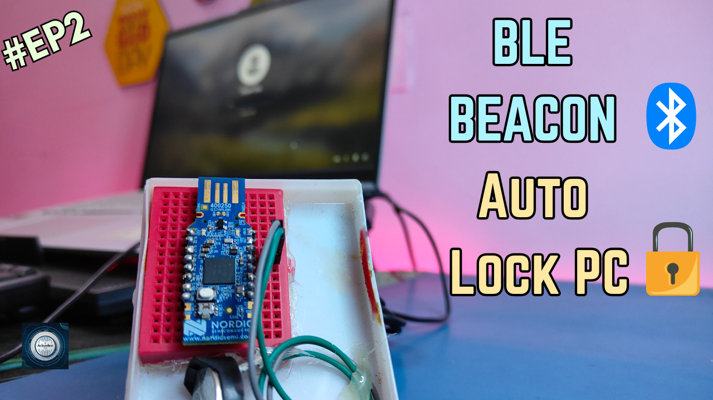
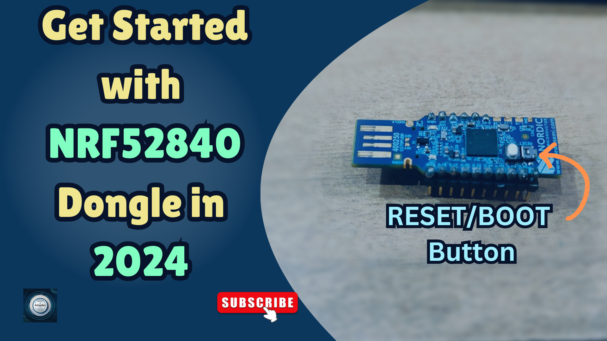

<h1 align="center">
  <a href="https://www.youtube.com/@eccentric_engineer">
	
  </a>  
</h1>

<h3 align="center">
	BLE Beacon Proximity Automation – Lock & Wake for PC and Phone
</h3>


  
## 📝 Overview

This repository is Part 2 and Part 3 of the **Beacon Proximity Automation** series.  
It demonstrates how to automate actions on your **PC and Android phone** using an **nRF52 BLE beacon** as a proximity sensor.

### 🚀 Features
- Lock or wake your **PC** automatically based on BLE signal strength (RSSI)
- Use a **Python script** on Windows to scan for beacon presence
- Trigger **Android screen lock or wake-up** using the **Automate app** with a no-root flow
- Simple integration with the **nRF52840 dongle** broadcasting in beacon mode (custom UUID)
- Lightweight, customizable, and privacy-friendly

### 📁 Contents
- `Python script (for PC)/`: Python script for scanning BLE and controlling PC lock/wake
- `Automate Project (for Phone)/`: Automate app `.flo` file and pdf

---

💡 Ideal for:
- Makers & developers exploring BLE automation
- Anyone looking to secure devices based on physical presence
- DIY smart office and desk automation


Platform used for firmware development is nRF Connect SDK on VSCode.  
Learn more 👇👇  

PC Automation Walkthrough & Demo Part 2 👇
  
[](https://youtu.be/Jg-yZ_TrmVc)  

Android Automation Walkthrough & Demo Part 3 👇  

[](https://youtu.be/gY8rUsAK_5A) 

## ✔️ Requirements

### 📦 Hardware
- nRF52840 Dongle (main controller  board)
- USB Female to Male Cable (optional, but recommended)
- CR2032 Coin cell battery (to power up dongle)

### 📂 Software
- VSCode (https://code.visualstudio.com/)  
- nRF Connect SDK (https://www.nordicsemi.com/Products/Development-software/nRF-Connect-SDK)
- nRF Connect for Desktop (https://www.nordicsemi.com/Products/Development-tools/nRF-Connect-for-Desktop)
- Automate app for Android Device (https://play.google.com/store/apps/details?id=com.llamalab.automate&hl=en_IN)

## 🛠️ Installation and usage

```sh
git clone https://github.com/AvinasheeTech/ble-beacon-proximity-automation.git
Open project in VSCode
Add Build Configuration -> Select nrf52840dongle_nrf52840 as board target -> Generate and Build
Open nRF Connect For Desktop App
Next Select Programmer -> Put Board in Bootloader mode -> Select Device -> Upload zephyr.hex output file from Build Directory of Project
Turn on Bluetooth and Location on Mobile Device -> Open NRF Connect App -> Check Beacon Advertisement data
For PC: Turn Bluetooth on -> Open Powershell -> Go to Python script (for PC) directory -> python main.py
For Phone: Turn Bluetooth and Location on -> Open Automate App -> Import .flo file downloaded from Automate Project (for Phone) directory
Open NRF Connect App ->  Scan Nearby Device and Use UUID to Identify Beacon -> copy Device Address to Automate .flo node "contains(...)" and
"RSSI[IndexOf...]" -> Save and Start Program 
Enjoy...🍹
```
To learn more about how to upload code to nRF52840 Dongle using VSCode and nRF Connect SDK, click link below 👇👇  

[](https://youtu.be/TeBvb645NZA?si=z5goAc1ic0ipf2cX)  

nrf52 BLE Beacon Formats Demo Part 1 👇

[](https://youtu.be/9BfXs-nhFsU)

## ⭐️ Show Your Support

If you find this helpful or interesting, please consider giving us a star on GitHub. Your support helps promote the project and lets others know that it's worth checking out. 

Thank you for your support! 🌟

[](https://github.com/AvinasheeTech/ble-beacon-proximity-automation/stargazers)
